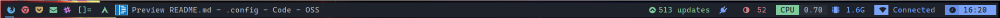
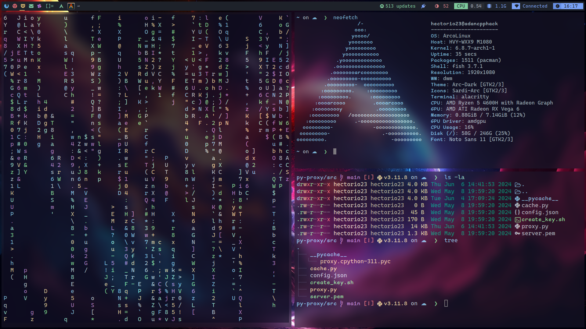

# This is my linux customization

`Note:` You can modify the shortcuts however you want.

This repository contains the following files custom
- Alacritty (A Simple terminal)
- DWM (TWM written in C) Faster!
- Nvim (lightweight text editor)
- Fish Shell
- Qtile (Tilling Window Manager written in Python)

## General Shortcuts

| Shortcut           | Action                                                                            |
|--------------------|-----------------------------------------------------------------------------------|
| `mod + Shift + l`  | Locks the screen using i3lock.                                                    |
| `mod + m`          | Opens the Rofi menu (applications).                                               |
| `mod + Shift + m`  | Opens the Rofi window selector.                                                   |
| `mod + f`          | Opens the Firefox browser.                                                        |
| `mod + Enter`      | Opens the Alacritty terminal.                                                     |
| `mod + r`          | Activates Redshift (color temperature adjustment).                                |
| `mod + Shift + r`  | Deactivates Redshift.                                                             |
| `mod + s`          | Takes a screenshot.                                                               |
| `mod + Shift + s`  | Takes a selection screenshot.                                                     |
| `mod + i`          | Opens IntelliJ IDEA.                                                              |
| `mod + c`          | Opens Visual Studio Code.                                                         |
| `mod + Shift + p`  | Opens Packet Tracer.                                                              |
| `XF86AudioLowerVolume` | Lowers the audio volume.                                                      |
| `XF86AudioRaiseVolume` | Raises the audio volume.                                                      |
| `XF86AudioMute`     | Mutes or unmutes the audio.                                                      |
| `XF86MonBrightnessUp` | Increases the monitor brightness.                                              |
| `XF86MonBrightnessDown` | Decreases the monitor brightness.                                            |

## Qtile

Qtile customization based on this configuration: [click here!](https://github.com/antoniosarosi/dotfiles/tree/master/.config/qtile)

Qtile is a lightweight and highly customizable dynamic window manager written in Python. It emphasizes efficiency and flexibility, organizing windows in a tiled layout by default but also supporting floating windows. Its configuration is entirely Python-based, providing users with extensive control and customization options, For more information, check their web page here -> [Qtile Web Page](https://qtile.org/).

#### Specific Qtile Shortcuts

| Shortcut           | Action                                                                            |
|--------------------|-----------------------------------------------------------------------------------|
| `mod + j`          | Switches to the lower window in the current stack.                                |
| `mod + k`          | Switches to the upper window in the current stack.                                |
| `mod + h`          | Switches to the left window in the current stack.                                 |
| `mod + l`          | Switches to the right window in the current stack.                                |
| `mod + Ctrl + l`   | Grows the current window (MonadTall).                                             |
| `mod + Shift + h`  | Shrinks the current window (MonadTall).                                           |
| `mod + Shift + f`  | Toggles between floating and tiling mode for the current window.                  |
| `mod + Shift + j`  | Moves the current window down in the stack.                                       |
| `mod + Shift + k`  | Moves the current window up in the stack.                                         |
| `mod + Tab`        | Switches to the next window layout.                                               |
| `mod + Shift + Tab`| Switches to the previous window layout.                                           |
| `mod + w`          | Closes the current window.                                                        |
| `mod + .`          | Switches focus to the next monitor.                                               |
| `mod + ,`          | Switches focus to the previous monitor.                                           |
| `mod + Ctrl + r`   | Restarts Qtile.                                                                   |
| `mod + Ctrl + q`   | Shuts down Qtile.                                                                 |

## DWM
DWM customization based on this configuration: [click here!](https://github.com/siduck/chadwm)

DWM (Dynamic Window Manager) is a minimalist, efficient tiling window manager for the X Window System. It supports tiling and floating layouts, uses a tagging system instead of virtual desktops, and is highly customizable by editing its source code. DWM is keyboard-driven for productivity, features a built-in status bar, and performs well on older hardware. Despite its simplicity, it can be extended with community patches and modifications.

#### Specific DWM Shortcuts

| Shortcut Combination                   | Action                                                 |
|----------------------------------------|--------------------------------------------------------|
| `SUPER + b`                            | Toggle status bar                                      |
| `SUPER + Control + t`                  | Toggle gaps                                            |
| `SUPER + Shift + Space`                | Toggle floating mode                                   |
| `SUPER + Shift + f`                    | Toggle fullscreen mode                                 |
| `SUPER + Control + w`                  | Toggle tab mode                                        |
| `SUPER + j`                            | Focus next window in stack                             |
| `SUPER + k`                            | Focus previous window in stack                         |
| `SUPER + d`                            | Decrease number of master windows                      |
| `SUPER + Left`                         | Shift view left                                        |
| `SUPER + Right`                        | Shift view right                                       |
| `SUPER + Shift + o`                    | Reset client area size                                 |
| `SUPER + Shift + j`                    | Move window down in stack                              |
| `SUPER + Shift + k`                    | Move window up in stack                                |
| `SUPER + Shift + Return`               | Zoom focused window                                    |
| `SUPER + Tab`                          | View all windows                                       |
| `SUPER + Control + i`                  | Increase overall gaps                                  |
| `SUPER + Control + d`                  | Decrease overall gaps                                  |
| `SUPER + Shift + i`                    | Increase inner gaps                                    |
| `SUPER + Control + Shift + i`          | Decrease inner gaps                                    |
| `SUPER + Control + o`                  | Increase outer gaps                                    |
| `SUPER + Control + Shift + o`          | Decrease outer gaps                                    |
| `SUPER + Control + 6`                  | Increase inner horizontal gaps                         |
| `SUPER + Control + Shift + 6`          | Decrease inner horizontal gaps                         |
| `SUPER + Control + 7`                  | Increase inner vertical gaps                           |
| `SUPER + Control + Shift + 7`          | Decrease inner vertical gaps                           |
| `SUPER + Control + 8`                  | Increase outer horizontal gaps                         |
| `SUPER + Control + Shift + 8`          | Decrease outer horizontal gaps                         |
| `SUPER + Control + 9`                  | Increase outer vertical gaps                           |
| `SUPER + Control + Shift + 9`          | Decrease outer vertical gaps                           |
| `SUPER + Control + Shift + d`          | Reset gaps to default                                  |
| `SUPER + t`                            | Set tiling layout                                      |
| `SUPER + Control + g`                  | Set grid layout                                        |
| `SUPER + Control + Shift + t`          | Set centered master layout                             |
| `SUPER + Space`                        | Toggle between layouts                                 |
| `SUPER + Control + ,`                  | Cycle previous layout                                  |
| `SUPER + Control + .`                  | Cycle next layout                                      |
| `SUPER + 0`                            | View all tags                                          |
| `SUPER + Shift + 0`                    | Apply all tags to focused window                       |
| `SUPER + ,`                            | Focus previous monitor                                 |
| `SUPER + .`                            | Focus next monitor                                     |
| `SUPER + Shift + ,`                    | Move focused window to previous monitor                |
| `SUPER + Shift + .`                    | Move focused window to next monitor                    |
| `SUPER + Shift + w`                    | Reset border size                                      |
| `SUPER + Control + q`                  | Kill DWM                                               |
| `SUPER + w`                            | Close focused window                                   |
| `SUPER + Control + r`                  | Restart DWM                                            |
| `SUPER + e`                            | Hide focused window                                    |
| `SUPER + Shift + e`                    | Restore hidden window                                  |

**Status Bar**

--------------------------------------------

**Terminal View**

