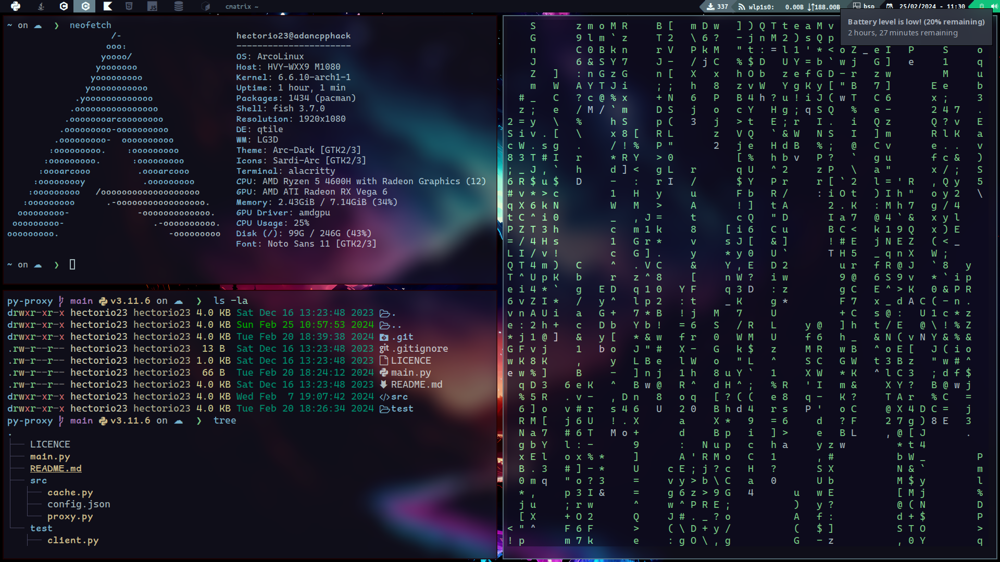
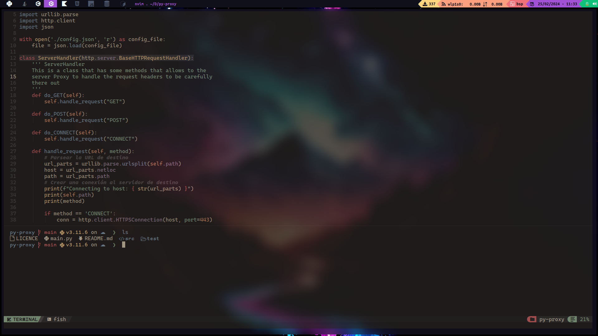

# This is my linux customization

`Note:` For the moment I am making some corrections, for that reason 
here are not all the file.

This repository contains the following files custom
- Alacritty (A Simple terminal)
- DWM (Comming Soon!) :)
- Nvim (lightweight text editor)
- Fish Shell
- Qtile (Tilling Window Manager written in Python)

## Qtile

Qtile customization based on this configuration: [click here!](https://github.com/antoniosarosi/dotfiles/tree/master/.config/qtile)

Qtile is a lightweight and highly customizable dynamic window manager written in Python. It emphasizes efficiency and flexibility, organizing windows in a tiled layout by default but also supporting floating windows. Its configuration is entirely Python-based, providing users with extensive control and customization options, For more information, check their web page here -> [Qtile Web Page](https://qtile.org/).

## DWM

### Comming soon!.

## Shortcuts

| Atajo              | Acción                                                                            |
|--------------------|-----------------------------------------------------------------------------------|
| `mod + j`          | Cambia a la ventana inferior en la pila actual.                                    |
| `mod + k`          | Cambia a la ventana superior en la pila actual.                                    |
| `mod + h`          | Cambia a la ventana izquierda en la pila actual.                                   |
| `mod + l`          | Cambia a la ventana derecha en la pila actual.                                     |
| `mod + Ctrl + l`   | Hace crecer la ventana actual (MonadTall).                                          |
| `mod + Shift + h`  | Reduce el tamaño de la ventana actual (MonadTall).                                  |
| `mod + Shift + f`  | Alterna entre modo flotante y mosaico para la ventana actual.                       |
| `mod + Shift + j`  | Mueve la ventana actual hacia abajo en la pila.                                     |
| `mod + Shift + k`  | Mueve la ventana actual hacia arriba en la pila.                                    |
| `mod + Tab`        | Cambia al siguiente diseño de ventanas.                                             |
| `mod + Shift + Tab`| Cambia al diseño de ventanas anterior.                                              |
| `mod + w`          | Cierra la ventana actual.                                                           |
| `mod + .`          | Cambia el enfoque al siguiente monitor.                                             |
| `mod + ,`          | Cambia el enfoque al monitor anterior.                                              |
| `mod + Ctrl + r`   | Reinicia Qtile.                                                                     |
| `mod + Ctrl + q`   | Apaga Qtile.                                                                        |
| `mod + Shift + l`  | Bloquea la pantalla usando i3lock.                                                  |
| `mod + m`          | Abre el menú Rofi (aplicaciones).                                                   |
| `mod + Shift + m`  | Abre el selector de ventanas Rofi.                                                  |
| `mod + f`          | Abre el navegador Firefox.                                                          |
| `mod + e`          | Abre el explorador de archivos PCManFM.                                             |
| `mod + Enter`      | Abre la terminal Alacritty.                                                         |
| `mod + r`          | Activa Redshift (ajuste de temperatura del color).                                  |
| `mod + Shift + r`  | Desactiva Redshift.                                                                 |
| `mod + s`          | Captura de pantalla.                                                                |
| `mod + Shift + s`  | Captura de pantalla de selección.                                                   |
| `mod + i`          | Abre IntelliJ IDEA.                                                                 |
| `mod + c`          | Abre Visual Studio Code.                                                             |
| `mod + b`          | Abre el navegador Brave.                                                             |
| `mod + Shift + p`  | Abre Packet Tracer.                                                                 |
| `XF86AudioLowerVolume` | Reduce el volumen del audio.                                                      |
| `XF86AudioRaiseVolume` | Aumenta el volumen del audio.                                                     |
| `XF86AudioMute`     | Silencia o reanuda el audio.                                                      |
| `XF86MonBrightnessUp` | Aumenta el brillo del monitor.                                                   |
| `XF86MonBrightnessDown` | Reduce el brillo del monitor.                                                    | 

